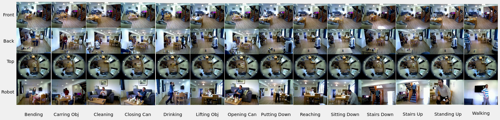

# One Stream Model Training with RHM Dataset

This repository is dedicated to training one stream models, specifically C3D, SlowFast, R2+1D, and R3D, using the RHM (Robotics Human Monitoring) dataset. It's optimized for advanced video analysis tasks in robotics through single-stream video processing.



## Files Description

- `config.py`: 
    - Contains configuration parameters for the RHM dataset.
    - Settings include dataset names, view types, and frame statuses.

- `dataloader.py`: 
    - Implements data loading logic for the RHM dataset.
    - Handles the efficient loading and processing of dataset for different models.

- `PretrainModelPath.py`: 
    - Manages the paths to the pretrained models.
    - Facilitates easy loading and integration of pretrained models for training.

- `train.py`: 
    - Contains the training pipeline for the models.
    - Incorporates model definitions, data loading, and the training process.

- `models/`:
  - Contains the model architectures for `C3D`, `SlowFast`, `R2+1D`, and `R3D`. 
  - Each model has its own dedicated sub-folder within this directory.

- `SplitList/`:
    - Contains data split files (`testlist.txt`, `trainlist.txt`, `vallist.txt`).
    - These files are used for segregating the dataset into training, testing, and validation sets.

## System Requirements

- Python 3.8
- PyTorch
- OpenCV
- NumPy
- TensorBoardX
- Matplotlib
- Seaborn
- Pandas

## Installation

1. Clone the repository:
    ```bash
    git clone https://gitlab.com/robothouse/rh-user/rhm_oneview.git
    ```

2. Install the required packages:
    ```bash
    pip install -r requirements.txt
    ```

3. Copy the split list files from the `SplitList/` folder to the root of the RHM dataset folder.

## Usage

1. Set up the configuration in `config.py` for the RHM dataset.
2. Run `train.py` to train the C3D, SlowFast, R2+1D, and R3D models:
    ```bash
    python train.py
    ```
3. The `dataloader.py` script will handle the data loading based on the specified model and dataset splits.


## Processing RHM Dataset

Before using the RHM dataset with this repository, you may need to process the video files to extract frames. To facilitate this, you can use a separate repository designed for video frame extraction. Follow the steps below:

1. Use the [RHM Dataset Frame Extraction](https://github.com/Bamorovat/RHM_OneView.git) repository to extract frames from the RHM dataset videos.

## RHM Help

For assistance with obtaining the **RHM** dataset, send an email to Patrick at [p.holthaus@herts.ac.uk](mailto:p.holthaus@herts.ac.uk). More information about the Robot House, where the dataset was collected, can be found at [Robot House Website](https://robothouse.herts.ac.uk/).

## RHM Citation

If you are using the **RHM** dataset or this code in your research, please cite the following paper:

Bamorovat Abadi, M., Shahabian Alashti, M. R., Holthaus, P., Menon, C., & Amirabdollahian, F. (2023). RHM: Robot House Multi-View Human Activity Recognition Dataset. In ACHI 2023: The Sixteenth International Conference on Advances in Computer-Human Interactions. IARIA.

[Paper Link](https://www.thinkmind.org/index.php?view=article&articleid=achi_2023_4_160_20077)

Bibtex:
```
@inproceedings{bamorovat2023rhm,
title={Rhm: Robot house multi-view human activity recognition dataset},
author={Bamorovat Abadi, Mohammad and Shahabian Alashti, Mohamad Reza and Holthaus, Patrick and Menon, Catherine and Amirabdollahian, Farshid},
booktitle={ACHI 2023: The Sixteenth International Conference on Advances in Computer-Human Interactions},
year={2023},
organization={IARIA}
}
```


## License

This project is licensed under the GNU General Public License (GPL) v3.
